# CSCE 435 Group project


## 0. Group number: 23


## 1. Group members:
1. Jeffrey Mitchell
2. Ren Mai
3. Brandon Cisneros
4. Christiana Vancura


## 2. Project topic (e.g., parallel sorting algorithms)
This project seeks to both implement and evaluate the similarities and differences between different parallel sorting algorithms with regards to problem size, problem type, and behavior regarding both strong and weak scaling. The parallel sorting algorithms chosen for the scope of this project include the following: bitonic, sample, merge, and radix sort.


### 2a. Brief project description (what algorithms will you be comparing and on what architectures)

#### Bitonic Sort:
Bitonic sort assumes an input size that is a power of 2. This algorithm uses many different processors as a network of comparators in order to sort a sequence. This algorithm must first ensure that data is in a bitonic sequence before sorting. A sequence of numbers is bitonic if it consists of a first substring of strictly non-decreasing numbers, followed by a substring of strictly non-increasing numbers. Once a bitonic sequence is generated, the algorithm can then merge the sequence into a fully sorted list. This can be repeated at scale to sort large sequences. To implement this sorting algorithm, we will be using the MPI architecture.

#### Sample Sort:
Sample sort does not assume any input size, but will split the input into p (the number of processors) buckets. Thus it will be easier to use inputs of size powers of 2. The algorithm splits the initial input into p sections, sorts them using quicksort, and samples s elements from each. These samples are then sorted (again using quicksort), and p-1 elements are chosen as splitters. Each processor splits its input bucket based on the splitters and sends the resultant buckets to the corresponding processor (bucket 0 to 0, 1 to 1, and so on). The total input is thus split into p buckets, which are sorted using bucket sort by each processor. These are then combined to return a sorted list. We will be using MPI architecture to implement sample sort.

#### Merge Sort:
Merge sort works by repeatedly merging larger and larger sorted subsets of an array.
It is not confined to particular input array sizes, and as a comparison-based sorting algorithm,
it can operate on any comparable data type. Merge sort is a divide and conquer algorithm.
In its base case, a subarray of length 0 or 1 is already sorted, and at each step, merge sort
merges two sorted arrays by stepping through them and popping the smallest remaining element from
either. In a parallel environment, each of the `p` nodes will sort itself normally, then will
cooperate to continue the merges across process boundaries, until the array is fully sorted.
For the first layer, odd and even processes will merge with each other, with the odd processes
taking the higher halfs of each pair's array elements. The processes will then sort themselves
into sets of four and use three 2-way merges to generate consistency among the four processors.
The number of processes per group will continue doubling until the full composite array is sorted.
Our implementation will use the MPI architecture.

#### Radix Sort:
Radix sort assumes that the input elements of the problem statement are k digit numbers. The algorithm sorts the elements through means of buckets; by sorting elements by their digits, Radix Sort is able to linearly sort elements as it sorts from least to most significant digit. For the sake of this sorting algorithm, we will be using the MPI architecture.


### 2b. Pseudocode for each parallel algorithm
- For MPI programs, include MPI calls you will use to coordinate between processes

#### Bitonic Sort:
##### MPI calls used to coordinate between processes:
- `MPI_Init(...)`
- `MPI_Comm_rank(...)`
- `MPI_Comm_size(...)`
- `MPI_Send(...)`
- `MPI_Recv(...)`
- `MPI_Comm_split(...)`
- `MPI_Gather(...)`
- `MPI_Scatter(...)`
- `MPI_Finalize(...)`
- `MPI_Barrier(...)`
##### Pseudocode
```C
if worker process:
    receive subarray

    # Make own subarray bitonic sequence
    for each 2-element pair in subarray:
        if odd count pair:
            sort ascending
        if even count pair:
            sort descending
    for each 4-element pair in subarray:
        if odd count pair:
            sort ascending
        if even count pair:
            sort descending
    etc. until subarray is bitonic

    # Multi-step bitonic merge
    for each compare-swap level needed (1 - log2(# of processes)):
        find partner process
        exchange data with partner (MPI_sendrecv)
        if "inferior" partner:
            keep smaller half of data
        else if "superior" partner:
            keep larger half of data

    Send sorted subarray to master

else if master process:
    send subarrays to worker processes (MPI_Scatter)
    receieve sorted subarrays/gather them (MPI_Gather)
    merge sorted subarrays
    return sorted list
```

#### Sample Sort:
##### MPI calls used to coordinate between processes:
- `MPI_Init(...)`
- `MPI_Comm_rank(...)`
- `MPI_Comm_size(...)`
- `MPI_Send(...)`
- `MPI_Recv(...)`
- `MPI_Comm_split(...)`
- `MPI_Gather(...)`
- `MPI_Scatter(...)`
- `MPI_Allgather(...)`
- `MPI_Finalize(...)`
- `MPI_Barrier(...)`
##### Pseudocode
```C
split initial array into subarrays
for each process
    sort each subarray using quicksort
    send process 0 `s` elements (MPI_Send)
barrier (MPI_Barrier)
process 0 receives `s` elements (MPI_Gather)
process 0 sorts elements with quicksort
process 0 chooses `p-1` splitters
process 0 sends splitters to all processes (MPI_Scatter)
for each process
    receive splitters (MPI_Receive)
    from each subarray split on splitters into `p` buckets
    send bucket 0 to process 0, bucket 1 to process 1, ... , bucket `p-1` to process `p-1` (MPI_Scatter)
    barrier (MPI_Barrier)
    processes receive buckets (MPI_Allgather)
    bucket sort received buckets
    send received buckets to process 0 (MPI_Send)
process 0 receives and concatenates buckets (MPI_Gather) 
process 0 returns sorted bucket 0, bucket 1, ..., bucket `p-1`

```

#### Merge Sort:
##### MPI calls used:
- `MPI_Init(...)`
- `MPI_Comm_size(...)`
- `MPI_Comm_rank(...)`
- `MPI_Send(...)`
- `MPI_Recv(...)`
- `MPI_Finalize(...)`
##### Pseudocode
```C
// Sort a fully-local array with standard merge sort:
local_merge_sort(array, size):
    if (size < 2):
        return
    local_merge_sort(array, size/2)
    local_merge_sort(&array[size/2], size/2)

    tmp_array_i = new array of length size/2
    tmp_array_j = new array of length size/2
    for i from 0 to size/2 - 1, inclusive:
        tmp_array_i[i] = array[i]
        tmp_array_j[i] = array[size/2 + i]

    i = 0
    j = 0
    while (i < size/2 or j < size/2):
        if (i == size/2):
            array[i+j] = tmp_array_j[j]
            j++
            continue
        if (j == size/2):
            array[i+j] = tmp_array_i[i]
            i++
            continue
        if (tmp_array_i[i] <= tmp_array_j[j]):
            array[i+j] = tmp_array_i[i]
            i++
        else:
            array[i+j] = tmp_array_j[j]
            j++

// Take only the bottom half of the provided values and merge them:
merge_bottom_half(array_i, array_j, array_out, size):
    i = 0
    j = 0
    while (i + j < size):
        if (array_i[i] <= array_j[j]):
            array_out[i+j] = array_i[i]
            i++
        else:
            array_out[i+j] = array_j[j]
            j++

// Take only the top half of the provided values and merge them:
merge_top_half(array_i, array_j, array_out, size):
    i = size-1
    j = size-1
    out_place = size-1
    while (out_place >= 0):
        if (array_i[i] <= array_j[j]):
            array_out[out_place] = array_i[i]
            i--
        else:
            array_out[out_place] = array_j[j]
            j--
        out_place--

// Merge with one specific neighbor. Relative ranks determine which one gets the higher
// or lower array elements.
merge_2_way(neighbor_id):
    Send local_subarray to neighbor_id via MPI_Send()
    Receive remote_subarray from neighbor_id via MPI_Recv()
    new_subarray = allocate new array of length (n/p)
    if (neighbor_id > local_rank):
        // Neighbor has a higher rank, meaning this process will get the lower values.
        merge_bottom_half(local_subarray, remote_subarray, new_subarray, n/p)
    else:
        // Neighbor has a lower rank, meaning this process will get the higher values.
        merge_top_half(local_subarray, remote_subarray, new_subarray, n/p)
    Deallocate local_subarray
    Set local_subarray = new_subarray

// Use a combination of 2-way merges to combine two sorted chunk_size/2 sized chunks
// into one sorted chunk_size sized chunk. Each offset=x iteration isolates another
// process at the top and bottom of the chunk as definitely being sorted within the
// new chunk. At the last iteration, only the middle two processes merge with each
// other, because they're the only two not confirmed to be sorted yet.
merge_n_way(chunk_size):
    rank_within_chunk = local_rank % chunk_size

    offset = chunk_size / 2
    min_offset = chunk_size/2 - rank_within_chunk
    if (rank_within_chunk >= chunk_size / 2):
        min_offset = -min_offset + 1
    while (offset >= min_offset):

        // Choose offset direction based on whether this process is in the top or bottom
        // half of the chunk:
        if (rank_within_chunk < chunk_size/2):
            merge_2_way(local_rank + offset)
        else:
            merge_2_way(local_rank - offset)
        offset--

MPI_Init()

p = MPI_Comm_size()
local_rank = MPI_Comm_rank()

local_subarray = New array with (n/p) elements generated according to the specified input type

local_merge_sort(local_array, n/p)
k = 1
while k < n:
    k *= 2
    // Example: k=4.
    // Odd and even processes have already merged, meaning there are p/2 sorted distributed
    // subarrays spanning 2 processes each, and this next step will consolidate them into p/4
    // sorted distributed subarrays spanning 4 processes each.
    merge_n_way(k)

// Double-check sorting:
for i from 1 to (n/p - 1):
    assert local_array[i-1] <= local_array[i]

// Send top value to next process and bottom value to previous process:
if (local_rank < p-1):
    Send local_array[n/p - 1] to (local_rank+1) via MPI_Send()
if (local_rank > 0):
    Send local_array[0] to (local_rank-1) via MPI_Send()
    Receive the value next_lower from (local_rank-1) via MPI_Recv()
    assert local_array[0] >= next_lower
if (local_rank < p-1):
    Receive the value next_higher from (local_rank+1) via MPI_Recv()
    assert local_array[n/p - 1] <= next_higher

MPI_Finalize()
```

#### Radix Sort:
##### MPI calls used to coordinate between processes:
- `MPI_Init(...)`
- `MPI_Comm_rank(...)`
- `MPI_Comm_size(...)`
- `MPI_Send(...)`
- `MPI_Recv(...)`
- `MPI_Comm_split(...)`
- `MPI_Gather(...)`
- `MPI_Finalize(...)`
- `MPI_Barrier(...)`
##### Pseudocode
**Note: Implementation can take many forms with regards to digits. For example, we can do base 10, base 2, and etc. For the sake of this pseudocode, we abstract this away by simply calling the extracted variable `digit`.**
```C
# Note: we can either generate the problem using centralized master, and provide data by sending with offset, or have the processes generate based on rank independently to avoid sending overhead.

if Master:
    generate the specified problem type(sorted, sorted with 1% swap, etc...)
    send offsets to worker processes #MPI_Send(...)
    
if worker process:
    receive offset for processing #MPI_Send(...)
    #create local bucket storage
    histogramBucket[numProcs][numBuckets]

    # compute and build histogram for offset (sort local offset) by determining how many elements should go into each bucket histogramBucket[numProc][bucket]

    for each item  i in the array offset:
        #determine bucket to place a[i]
        bucket = compute_bucket(a[i])
        #increment the bucket count
        histogramBucket[numProc][bucket]++

    MPI_Barrier() # to wait for all worker processors to finish computing

# master processor determines the position for each by doing prefix sum to determine final output location for element
# this is the sequential portion
if master proc:
    base = 0
    for bucket in numBuckets:
        for numProc in numProcs:
            # add base to the histogramBucketLocation and compute partial sum to determine index of each bucket
            histogramBucket[numProc][bucket] += base

            #update base, we are computing prefix
            base = histogramBucket[numProc][bucket]

MPI_Barrier(...) # wait for this indexer algorithm to be determined 
MPI_Scatter(...) # send the indices information to the workers so they correct indices to place their offset elements 
if worker process:
    for each item i in array offset:
        bucket = compute_bucket(a[i])
        #place the item a[i] in the correct location
        # send the item to the proc that takes care of that offset or have a global output array:
        if histogramBucket[numProc][bucket] index is within the worker offset domain:
            outputResult[histogramBucket[numProc][bucket]++] =a[i]
        else:
            MPI_send(...) to the correct proc with the index
    MPI_Recv(...) items and their indices and place into correct offset location
```


### 2c. Evaluation plan - what and how will you measure and compare
____

#### Input sizes, Input types
With regards to input sizes and input types for the project, the sorting algorithms implemented will test the following specifications:
##### Input sizes for the array being sorted:
The input size of the array being sorted will take on sizes such that size corresponds to powers of two. This is done to ensure that data partitioning for each process will result in relatively similar problem subset sizes. In particular, the problem sizes being tested involve the following:
$$2^{16}$$
$$2^{18}$$
$$2^{20}$$
$$2^{22}$$
$$2^{24}$$
$$2^{26}$$
$$2^{28}$$

##### Input types:
Input types utilized in the project will take the following configurations:
- Sorted 
    - The array passed in as input will already be in sorted form.
- Random
    - The array passed in as input will include randomly generated elements such that the array is very likely unsorted.
- Reverse sorted
    - The array passed in as input is sorted, but uses the opposite order. 
    - *(e.g. If we are sorting descending, the reverse sorted array will be ascending and vice versa)*
- 1% Perturbed
    - The array is mostly sorted, with 1% of array items being swapped or placed in unsorted positions.

##### Number of Processes used:
For the sake of this project, the number of processes being tested will also be done using powers of two. More specifically, the process counts utilized in runs will include the following process counts: 2, 4, 8, 16, 32, 64, 128, 256, 512, and 1024.

#### Strong scaling
The strong scaling potential of an algorithm can be analyzed by keeping the problem size fixed while increasing the number of processors/nodes. For each algorithm, this will be measured by recording the time it takes to work through an input of a constant size when utilizing varying amounts of processors. We will increase processor count progressively, testing powers of two for their performance (2, 4, 8, 16 processors, etc.). The actual problem size will be decided based on benchmarking a small processor count in order to ensure that jobs can complete on a reasonable timescale (hours at most). The corresponding decrease (or increase) in execution time will allow us to measure the relative strong scaling of each algorithm.

#### Weak scaling (increase problem size, increase number of processors)
An algorithm's weak scaling is dependent on how well additional processes allow it to solve
larger problems in a similar amount of time. For each of the above algorithms, we will evaluate
weak scaling by measuring runtime while the number of processes and length are kept proportional:
We will test a problem size $n=2^{20}$ with $p=4$ processes, $n=2^{22}$ with $p=16$,
$n=2^{24}$ with $p=64$, $n=2^{26}$ with $p=256$, and $n=2^{28}$ with $p=1024$. When graphed,
effective weak scaling will maintain a mild or even slope, and ineffective weak scaling will show
steeply increasing runtime as the problem size and processor count increase.

### 2d. How the team will communicate:
- For the sake of this project, the team has decided to go forward with using Slack as the main form of communication, with periodic in-person meetings for discussion and implementation of the algorithms at hand.

### 3a. Caliper instrumentation
Please use the caliper build `/scratch/group/csce435-f24/Caliper/caliper/share/cmake/caliper` 
(same as lab2 build.sh) to collect caliper files for each experiment you run.

Your Caliper annotations should result in the following calltree
(use `Thicket.tree()` to see the calltree):
```
main
|_ data_init_X      # X = runtime OR io
|_ comm
|    |_ comm_small
|    |_ comm_large
|_ comp
|    |_ comp_small
|    |_ comp_large
|_ correctness_check
```

Required region annotations:
- `main` - top-level main function.
    - `data_init_X` - the function where input data is generated or read in from file. Use *data_init_runtime* if you are generating the data during the program, and *data_init_io* if you are reading the data from a file.
    - `correctness_check` - function for checking the correctness of the algorithm output (e.g., checking if the resulting data is sorted).
    - `comm` - All communication-related functions in your algorithm should be nested under the `comm` region.
      - Inside the `comm` region, you should create regions to indicate how much data you are communicating (i.e., `comm_small` if you are sending or broadcasting a few values, `comm_large` if you are sending all of your local values).
      - Notice that auxillary functions like MPI_init are not under here.
    - `comp` - All computation functions within your algorithm should be nested under the `comp` region.
      - Inside the `comp` region, you should create regions to indicate how much data you are computing on (i.e., `comp_small` if you are sorting a few values like the splitters, `comp_large` if you are sorting values in the array).
      - Notice that auxillary functions like data_init are not under here.
    - `MPI_X` - You will also see MPI regions in the calltree if using the appropriate MPI profiling configuration (see **Builds/**). Examples shown below.

All functions will be called from `main` and most will be grouped under either `comm` or `comp` regions, representing communication and computation, respectively. You should be timing as many significant functions in your code as possible. **Do not** time print statements or other insignificant operations that may skew the performance measurements.

### **Nesting Code Regions Example** - all computation code regions should be nested in the "comp" parent code region as following:
```
CALI_MARK_BEGIN("comp");
CALI_MARK_BEGIN("comp_small");
sort_pivots(pivot_arr);
CALI_MARK_END("comp_small");
CALI_MARK_END("comp");

# Other non-computation code
...

CALI_MARK_BEGIN("comp");
CALI_MARK_BEGIN("comp_large");
sort_values(arr);
CALI_MARK_END("comp_large");
CALI_MARK_END("comp");
```

### **Calltree Example**:
```
# MPI Mergesort
4.695 main
├─ 0.001 MPI_Comm_dup
├─ 0.000 MPI_Finalize
├─ 0.000 MPI_Finalized
├─ 0.000 MPI_Init
├─ 0.000 MPI_Initialized
├─ 2.599 comm
│  ├─ 2.572 MPI_Barrier
│  └─ 0.027 comm_large
│     ├─ 0.011 MPI_Gather
│     └─ 0.016 MPI_Scatter
├─ 0.910 comp
│  └─ 0.909 comp_large
├─ 0.201 data_init_runtime
└─ 0.440 correctness_check
```

#### Bitonic Sort Calltree:
```
209.002 main
├─ 0.000 MPI_Init
├─ 0.184 data_init_runtime
├─ 206.203 comp
│  └─ 206.203 comp_large
├─ 0.981 comm
│  └─ 0.981 comm_large
│     ├─ 0.627 MPI_Barrier
│     └─ 0.354 MPI_Sendrecv
├─ 0.027 correctness_check
│  ├─ 0.000 MPI_Send
│  └─ 0.005 MPI_Recv
├─ 0.000 MPI_Finalize
├─ 0.000 MPI_Initialized
├─ 0.000 MPI_Finalized
└─ 0.009 MPI_Comm_dup
```

#### Sample Sort Calltree:
```
0.548 main
├─ 0.000 MPI_Init
├─ 0.000 data_init_runtime
├─ 0.030 comp
│  ├─ 0.030 comp_large
│  └─ 0.000 comp_small
├─ 0.003 comm
│  ├─ 0.002 comm_small
│  │  ├─ 0.002 MPI_Recv
│  │  └─ 0.000 MPI_Send
│  └─ 0.000 comm_large
│     ├─ 0.000 MPI_Send
│     └─ 0.000 MPI_Recv
├─ 0.005 MPI_Barrier
├─ 0.000 correctness_check
│  ├─ 0.000 MPI_Send
│  └─ 0.000 MPI_Recv
├─ 0.000 MPI_Finalize
├─ 0.000 MPI_Initialized
├─ 0.000 MPI_Finalized
└─ 0.000 MPI_Comm_dup
```

#### Merge Sort Calltree:
```
21.673 main
├─ 0.815 MPI_Comm_dup
├─ 0.000 MPI_Finalize
├─ 0.000 MPI_Finalized
├─ 0.000 MPI_Init
├─ 0.000 MPI_Initialized
├─ 5.162 comm
│  └─ 5.162 comm_large
│     ├─ 1.996 MPI_Recv
│     └─ 1.259 MPI_Send
├─ 13.214 comp
│  └─ 13.214 comp_large
├─ 1.174 correctness_check
│  ├─ 1.068 MPI_Recv
│  └─ 0.000 MPI_Send
└─ 0.738 data_init_runtime
```

#### Radix Sort Calltree:
```
# MPI Radix Sort
143.856 main
├─ 0.001 MPI_Comm_dup
├─ 0.000 MPI_Finalize
├─ 0.000 MPI_Finalized
├─ 0.000 MPI_Init
├─ 0.000 MPI_Initialized
├─ 24.575 comm
│  └─ 24.574 comm_small
│     ├─ 0.000 MPI_Allgather
│     ├─ 0.003 MPI_Allreduce
│     └─ 24.570 MPI_Barrier
├─ 118.738 comp
│  ├─ 118.733 comp_large
│  │  └─ 114.279 comm
│  │     └─ 104.602 comm_large
│  │        ├─ 5.384 MPI_Isend
│  │        └─ 84.708 MPI_Recv
│  └─ 0.004 comp_small
├─ 0.000 correctness_check
│  ├─ 0.000 MPI_Recv
│  └─ 0.000 MPI_Send
└─ 0.003 data_init_runtime 
```
### 3b. Collect Metadata

Have the following code in your programs to collect metadata:
```
adiak::init(NULL);
adiak::launchdate();    // launch date of the job
adiak::libraries();     // Libraries used
adiak::cmdline();       // Command line used to launch the job
adiak::clustername();   // Name of the cluster
adiak::value("algorithm", algorithm); // The name of the algorithm you are using (e.g., "merge", "bitonic")
adiak::value("programming_model", programming_model); // e.g. "mpi"
adiak::value("data_type", data_type); // The datatype of input elements (e.g., double, int, float)
adiak::value("size_of_data_type", size_of_data_type); // sizeof(datatype) of input elements in bytes (e.g., 1, 2, 4)
adiak::value("input_size", input_size); // The number of elements in input dataset (1000)
adiak::value("input_type", input_type); // For sorting, this would be choices: ("Sorted", "ReverseSorted", "Random", "1_perc_perturbed")
adiak::value("num_procs", num_procs); // The number of processors (MPI ranks)
adiak::value("scalability", scalability); // The scalability of your algorithm. choices: ("strong", "weak")
adiak::value("group_num", group_number); // The number of your group (integer, e.g., 1, 10)
adiak::value("implementation_source", implementation_source); // Where you got the source code of your algorithm. choices: ("online", "ai", "handwritten").
```

They will show up in the `Thicket.metadata` if the caliper file is read into Thicket.

#### Bitonic Sort Metadata:
Columns:
```
Index(['cali.caliper.version', 'mpi.world.size', 'spot.metrics',
       'spot.timeseries.metrics', 'spot.format.version', 'spot.options',
       'spot.channels', 'cali.channel', 'spot:node.order', 'spot:output',
       'spot:profile.mpi', 'spot:region.count', 'spot:time.exclusive',
       'spot:time.variance', 'launchdate', 'libraries', 'cmdline', 'cluster',
       'algorithm', 'programming_model', 'data_type', 'size_of_data_type',
       'input_size', 'input_type', 'num_procs', 'scalability', 'group_num',
       'implementation_source'],
      dtype='object')
```
Values:

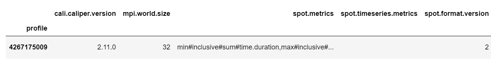
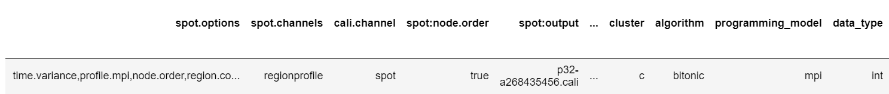
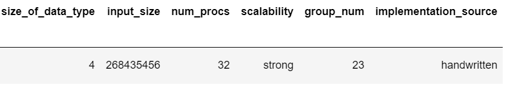

#### Sample Sort Metadata:
Columns:
```
Index(['cali.caliper.version', 'mpi.world.size', 'spot.metrics',
       'spot.timeseries.metrics', 'spot.format.version', 'spot.options',
       'spot.channels', 'cali.channel', 'spot:node.order', 'spot:output',
       'spot:profile.mpi', 'spot:region.count', 'spot:time.exclusive',
       'spot:time.variance', 'launchdate', 'libraries', 'cmdline', 'cluster',
       'algorithm', 'programming_model', 'data_type', 'size_of_data_type',
       'input_size', 'num_procs', 'scalability', 'group_num',
       'implementation_source'],
      dtype='object')
```
Values:

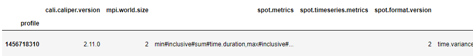

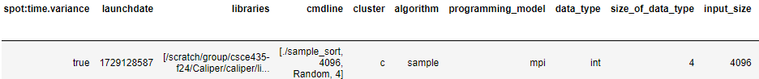
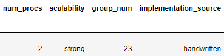


#### Merge Sort Metadata:
Columns:
```
Index(['cali.caliper.version', 'mpi.world.size', 'spot.metrics',
       'spot.timeseries.metrics', 'spot.format.version', 'spot.options',
       'spot.channels', 'cali.channel', 'spot:node.order', 'spot:output',
       'spot:profile.mpi', 'spot:region.count', 'spot:time.exclusive',
       'spot:time.variance', 'launchdate', 'libraries', 'cmdline', 'cluster',
       'algorithm', 'programming_model', 'data_type', 'size_of_data_type',
       'input_size', 'num_procs', 'scalability', 'group_num',
       'implementation_source'],
      dtype='object')
```

Values:

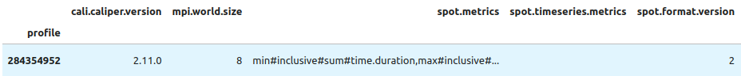
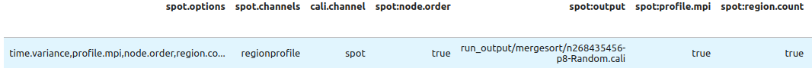
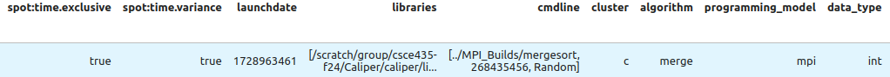
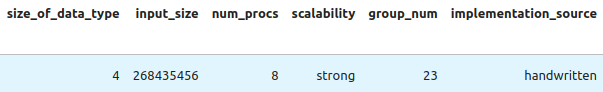

#### Radix Sort Metadata:
```
# Metadata Columns
Index(['cali.caliper.version', 'mpi.world.size', 'spot.metrics',
       'spot.timeseries.metrics', 'spot.format.version', 'spot.options',
       'spot.channels', 'cali.channel', 'spot:node.order', 'spot:output',
       'spot:profile.mpi', 'spot:region.count', 'spot:time.exclusive',
       'spot:time.variance', 'launchdate', 'libraries', 'cmdline', 'cluster',
       'algorithm', 'programming_model', 'data_type', 'size_of_data_type',
       'input_size', 'input_type', 'num_procs', 'scalability', 'group_num',
       'implementation_source'],
      dtype='object')
```
#### Metadata

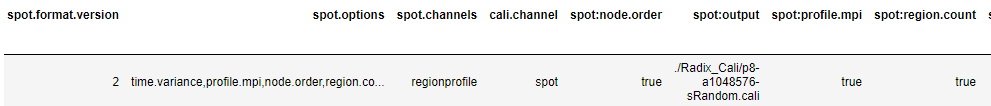
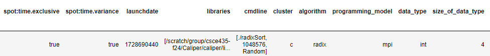
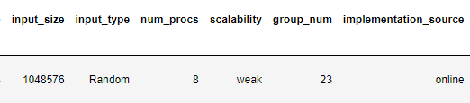
### **See the `Builds/` directory to find the correct Caliper configurations to get the performance metrics.** They will show up in the `Thicket.dataframe` when the Caliper file is read into Thicket.
## 4. Performance evaluation

Include detailed analysis of computation performance, communication performance. 
Include figures and explanation of your analysis.

### 4a. Vary the following parameters
For input_size's:
- 2^16, 2^18, 2^20, 2^22, 2^24, 2^26, 2^28

For input_type's:
- Sorted, Random, Reverse sorted, 1%perturbed

MPI: num_procs:
- 2, 4, 8, 16, 32, 64, 128, 256, 512, 1024

This should result in 4x7x10=280 Caliper files for your MPI experiments.

#### Bitonic Sort Parameters

The Bitonic Sort implementation is compatible with the varying parameters specified above, with one caveat. Currently, Grace encounters a networking error when ever `num_procs` is set to 1024. Because of this, the data for 1024 processors is currently unavailable until this issue is resolved.

Bitonic Sort's Caliper files are located in `bitonic_ipynb/Bitonic_Cali/`.

#### Sample Sort Parameters

The Sample Sort implementation is compatible with all of the `input_size`, `input_type`, and `num_procs` values, as well as `num_procs=1`. There is an additional parameter, `sample_size`, that is held constant at 1 throughout all of the runs. However, there are only 27 Caliper files available, as other runs with inputs larger than 1048576 timed out with a 2 hour time limit. Additionally, Grace was overrun with jobs and so not all lower number jobs with more than 2 processes were able to run. The timeouts likely occurred due to the non-parallel quicksort that was running on each individual process to sort their specific buckets, as this was selecting inferior pivots.

Sample Sort's Caliper files are located in `sample_ipynb/Sample_Cali/` .

#### Merge Sort Parameters

The Merge Sort implementation is compatible with all of the specified
`input_size`, `input_type`, and `num_procs` values (plus `num_procs=1`).
However, as of October 20, Grace began throwing Bootstrap errors within
`MPI_Init()` whenever `num_procs` was set to 1024. As a result, Merge Sort is
lacking 18 Caliper files with 1024 processes. Its graphs plot the available
1024-processor data whenever it is available.

Merge Sort's 4x7x11-18=290 Caliper files are located in
`merge_ipynb/Merge_Cali/`.

#### Radix Sort Parameters
The Radix sort implementation is compatible with all of the specified
`input_size`, `input_type`, and `num_procs` values. 

For the sake of this particular implementation of Radix, 240 cali files were collected instead of 280. This due to the fact Radix sort became inefficient for Random input at array size $2^{26}$, which aligns with the implementation for this particular instance of Radix. In particular, this ineffiency was with regards to Random input with process size 2, in which the job took longer than 3 hours to complete. Because Radix works by placing objects into buckets, and sorting by digit, this would incur more communication costs as local sorted arrays are redistributed to other processes with every step and result in substantially increased runtime.

Radix Sort's $4\cdot6\cdot10 = 240$ Caliper files are located in  
`radix_ipynb/Radix_Cali/`.

### 4b. Hints for performance analysis

To automate running a set of experiments, parameterize your program.

- input_type: "Sorted" could generate a sorted input to pass into your algorithms
- algorithm: You can have a switch statement that calls the different algorithms and sets the Adiak variables accordingly
- num_procs: How many MPI ranks you are using

When your program works with these parameters, you can write a shell script 
that will run a for loop over the parameters above (e.g., on 64 processors, 
perform runs that invoke algorithm2 for Sorted, ReverseSorted, and Random data).
  
The group has two scripts to automate job setup and runs:
`scripts/parameterized_job.py` and `MPI_Builds/radix_cmake/collect.sh`.

### 4c. You should measure the following performance metrics
- `Time`
    - Min time/rank
    - Max time/rank
    - Avg time/rank
    - Total time
    - Variance time/rank

All of these metrics were measured and recorded by Caliper. They are available
in each run's respective `.cali` file.

#### Multi-algorithm Performance Evaluation

Our algorithms took radically different times, forcing us to use a logarithmic
Y scale to keep all of the lines visibly distinct. We also focused our
comparison on Random input, with the largest input size that all of our
algorithms were able to sort (2^26), however we also briefly took a look at the
smallest input size too (2^16). Because none of our algorithms had master
processes, not even Merge Sort, we used "Average time / rank" for all of our
graphs.

##### Multi-algorithm Strong Scaling

For the large input sizes, all of the algorithms demonstrate faster runtimes
with additional processes, in both the main and comp_large regions. Except for
Radix Sort, the different algorithms' communication times gradually increased
with additional processes.

Computation time is the most frequent bottleneck for our algorithms. However,
at 32 processors, Merge Sort's bottleneck changes to communication. This
prevents its wall clock from scaling with additional processes, despite those
processes reducing its computation time more aggressively than the other
algorithms'.

Merge Sort's speed advantage diminishes when the input size is very small. With
an array size of 2^16, Merge and Bitonic Sort are essentially tied in wall
clock performance, with both algorithms sorting fastest with only two
processes. Interestingly, Radix Sort is the only algorithm whose wall clock
time benefitted from additional processes at the small input scale.

Overall, Merge Sort is the fastest way to sort any of the tested input sizes,
however its ideal process count varies depending on input size, from 2 to 16.

.png)
.png)
.png)
.png)

##### Multi-algorithm Strong Scaling Speedup

We calculated speedup according to the formula (2 * T_2) / T_p.

With a large input size, all algorithms' computation time reduced with
additional processors. 

Radix sort was the only algorithm where communication took less time as p
increased. Similarly, it's the only algorithm that benefited from additional
processes with very small input sizes.

While it's much faster than the other algorithms, Merge Sort does not have the
best speedup, and its change of bottleneck is particularly visible at ~p=32.
Radix Sort, on the other hand, appeared to achieve linear speedup, however at
the cost of overall high runtime.

.png)
.png)
.png)
.png)

##### Multi-algorithm Weak Scaling

Apart from an anomalous Bitonic Sort run with 128 processes, all algorithms
followed a similar pattern, with all regions' runtime gradually increasing
as input size and process count quadruple at each step.

With logarithmic scaling on both axes, all algorithms have roughly linear
graphs with positive slopes. This indicates imperfect weak scaling because
quadrupling the process count doesn't allow for solving quadruple the problem
size in the same amount of time. However, each algorithm's runtime increases
much less than 4x whenever array size and process count quadruple, meaning
the algorithms were still able to utilize their parallelism to make the larger
problems more feasible.

.png)
.png)
.png)

#### Bitonic Sort Performance Evaluation General Notes:
As directed in class, attempts were made to compare algorithms on the same scale (e.g. graphs have the same minY and maxY). However due to the wide variance of times in different algorithms, some scales have been altered to better illustrate the data. Additionally, as mentioned above, data from 1024 processor runs is not yet available due to Grace issues. Finally, in a small number of low processor jobs (~2), a system timeout stopped completion of the jobs. As directed in class, system resources were not expended to rerun these, and they are accounted for in analysis.

My implementation of bitonic sort was heavily dominated by computation time; There was very little variation in communication time between process counts and array sizes.  This is important to keep in mind during the analysis of the speedup and scaling graphs of my communication sections, as very small deviations can produce seemingly large speedups.  Regarding sensitivity to input type, I found that my implementation of Bitonic Sort is generally agnostic to input type, displaying very little correlation between input type and performance.  There is variation, but it is neither consistent, nor significant enough to make a pattern.

#### Bitonic Computation Performance
For computation times, this implementation of bitonic sort appears to be relatively agnostic to the initial conditions of the data that is to be sorted. It might be argued that Random and 1_perc_perturbed initial conditions appear to have somewhat higher computation times at lower processor counts, but this observation is neither consistent nor significant enough to draw any conclusions off of.

As expected, computation time tends to a decaying exponential pattern as more processors are introduced to the algorithm. There are of course some outliers in computation times, especially at low processor counts.  Some of these can be attributed to job timeouts which, in the interest of saving system resources, were not replicated as instructed in lecture. Despite these outliers, the general trend is quite clear that increasing processor count reduces computation time, with diminishing returns.

A few sample graphs to demonstrate these trends can be seen below, with the rest accessible at `bitonic_ipynb/Bitonic_Plots/`
.png)
.png)

#### Bitonic Communicaion Performance
In comparison to computation time, communication time is almost negligible in this implementation of bitonic sort. Communication time for this algorithm is, generally, several orders of magnitudes smaller than computation time. With the exception of a few major outliers, communication times for this algorithm are generally on the order of 1 - 2 seconds or less. Some of these outliers, however, shoot up to over 100 seconds stuck in communication. Like with the computation performance, this can likely be attributed to the few cases where a timeout stopped the completion of the sorting job.

This algorithm appears to also be agnostic to the initial sort type of the data regarding communication time.  There is little to no correlation in the initial conditions of an array and its communication time.

Finally, except for outliers, there also appears to be very little correlation between process communication time and process count in this implementation of bitonic sort. The graphs below demonstrate this trend.

A few sample graphs to demonstrate these trends can be seen below, with the rest accessible at `bitonic_ipynb/Bitonic_Plots/`
.png)
.png)

#### Bitonic Strong Scaling Observations:
Strong scaling speedup trends are observed as well. The strong scaling speedup for comm measurements can be misleading, as the small deviation in general can make the graphs appear to suggest massive speedups.

The more useful speedups can be seen in the measurement of comp speedup.  These graphs display a positive, linear relationship between process count and speedup.  This trend holds for all initial conditions (Sorted, ReverseSorted, etc.).

A few sample graphs to demonstrate these trends can be seen below, with the rest accessible at `bitonic_ipynb/Bitonic_Plots/`
.png)
.png)


#### Bitonic Weak Scaling Observations:
The weak scaling analysis also provides interesting insights.

As above, the generally negligible comm times somewhat obscure the picture of comm's weak scaling, however a generally exponential trend is still noticable.

The weak scaling of comp for bitonic sort shows that the algorithm does get less efficient for the same amount of work per processor as process count increases.

Since it is dominated by comp, main generally follows the trend of comp.

The weak scaling graphs can be seen below
.png)
.png)
.png)

#### Sample Sort Performance Evaluation:
##### Sample Computation Performance

When compared with other inputs, the Sorted input appeared to take longer than the other inputs, especially when run on 2 processes with an input size of 1048576, in which case it was the only one that timed out. This is possible due to the implementation of the local quicksort, which does not check if the array is sorted or not. In the case that the inputs are sorted, the implementation of sample sort works the same way. 

Note that the Sorted input took longer for 2 processes, but this was not true for all numbers of processes. The implementation of local quicksort chooses the last index as the pivot index. If the worst index is selected (which will occur for Sorted and Reverse Sorted arrays), this will increase the time complexity to O(n^2). This could also be a problem in the 1 Percent Perturbed inputs. 

Sample Sort has a significant portion of its runtime in large computation -- when the local processes sort their respective parameters. Given that they are choosing poor indexes as pivots (leading to unbalanced subarrays to be sorted), it makes sense that Sample Sort would take long amounts of time, of the order of at least O(n^2). 

.png)

##### Sample Communication Performance
For communication, the sample sort input types seemed to have similar communication costs. This makes sense, as due to the implementation all processes will send the same amount of data to all other processes, regardless of the need (the rest of the array is filled with -1s). 

Note that the 1 Percent Perturbed took longer than the other processes for communication with 2 processes. As MPI_Send and MPI_Receive were used, processes had to wait to receive before they could continue. Therefore, it is possible that some processes took longer than others to sort, and thus the others had to wait on them. However, the difference is less than 0.05 seconds, so this is likely due to the specific input generated for that case.

.png)

##### Sample Weak Scaling Observations:
Unfortunately, due to the current implementation of quicksort, multiple sample sort data points were not able to be obtained for weak scaling (as the input size was too big and timed out (recall that it is currently O(n^2) worst case complexity for quicksort). However, with a better implementation of quicksort or longer runtimes before timing out (currently set to 2 hours), there will likely be further observations. 

.png)
.png)
.png)

#### Merge Sort Performance Evaluation

My Merge Sort implementation is slightly unique in that it does not consolidate
the whole array into one master process. Processes maintain their own subarrays
throughout the entire run, meaning they can sort any array size as long as each
process has enough RAM to store 3n/p elements.

While it was significantly faster than the other algorithms, it did not
demonstrate the best speedup.

##### Merge Sort Computation

At the largest input sizes, Merge Sort's computation region observed consistent
drops in per-process computation time as more processes were added. This does,
however, drop off at greater scales, as the compound merges (which are the
alternative to having a single master process) require nodes to exchange data
with more neighbors and perform more full-size local merges.

Random inputs demonstrate significantly larger computation times with low
process counts. I see two explanations for this: First, random inputs cause
an if/elseif statement to execute later blocks and perform more comparisons.
Second, the random inputs may cause more cache misses, as the program
alternates more between reading new elements from the two input arrays.

.png)
.png)
##### Merge Sort Communication

Because this implementation does not centralize the array into a single master
process, it can keep communication concurrent throughout the entire run. While
communication time does increase each time the number of processors is doubled,
it maintains a very shallow slope on larger input sizes.

To avoid deadlocks in MPI functions, subarrays are sent in blocks of 512 or
less. While increasing process counts increase the number of neighbors that each
process must communicate with, the packets typically remain the same size,
explaining the very shallow slope slopes. On small input sizes and large process
counts, where the per-process subarray size is not a multiple of 512, Merge Sort
will wind up sending packets smaller than 512 values, reducing efficiency and
causing worse speedup.

Communication performance was not affected by the input type. This particular
implementation of merge sort accounts for this because it does not use any
extra knowledge of the array to dynamically determine how much data to send.
Each multi-process merge involves both processes sending each other the same
quantity of information every time.

.png)
.png)

##### Merge Sort Weak Scaling

Merge Sort is moderately successful at weak scaling. Each quadrupling of the
array elements (and correspondingly of processes) results in significantly less
than a quadrupling of the time required to sort. Even in the worst step,
the main function only doubles the time it takes. As a comparison-based sorting
algorithm, Merge Sort must make at least `O(n log n)` comparisons in the worst
case, meaning that any implementation will result in asymptotically greater than
linear work to perform as `n` increases.

While this implementation of Merge Sort has imperfect weak scaling in timing,
it is less constrained than other implementations in terms of memory. Because
the array never gets centralized, each process's memory consumption is
proportional to `n/p` (disregarding the constant overhead for MPI and the
program instructions), allowing larger problems to be completable.

.png)
.png)
.png)

#### Radix Sort Performance Evaluation:
##### Radix Computation Performance
With regards to computation, Reverse Sorted input computation appeared to act as an upper bound in comparison to the other sorts, which had similar, if not identical computation times. This aligns with our understanding of Radix Sort and its large computation, which involves the local sort of the partition array allocated to the process. Because Radix Sort computation involves sorting the local arrays using Counting Sort, determining prefix sum, and determining which arrays to send (as well a the global indices), Reverse Sorted requires more computation as more items need to be redistributed to the correct intermediary/final locations.

We see downward growing trends as well for computation time per individual process, which aligns with our understanding of problem partitioning among processes. As we increase number of processes, each process works with a smaller subproblem size such that individual computation decreases due to the local sort step having less to sort on a process. This trend is consistent with other problem sizes as well.
.png)
.png)
.png)

Typically, for Radix, the time to sort (with regards to local computation) is relatively the same regardless of input type, as for this particular implementation, a counting sort method was used for local sorting.

As a result, variance in runtime for this particular radix sort implementation became dependent on amount of communication needed for the redistribution step, where local array indices were redistributed based on global prefix sum.

This caused reverse sorted input types to incur increased communication times, as for a particular local subarray problem, the maximum amount of elements to be sent to other processes would be the entire local subarray. This pattern can be observed below in the Strong scaling for Radix at the largest size input it could run.

.png)

##### Radix Communication Performance
With regards to communication, the reverse sorted input type consistently appeared to incur larger communication costs compared to the other three processes. This aligns with our understanding of the Radix sort implementation used for this project, as following local sort, the index location of a particular array item would be determined through counting the global prefix sum. Because Radix sort sorts from least significant to most significant digit using buckets, this would result in ReverseSorted input types incurring more communication costs during the distribution phase of radix sort, which distributed array items based on their digit index being used.
.png).png)

What is also interesting to note is how time communicating on each process decreased as process size increased. Because this implementation of radix sort used caliper to count the amount of time a process spent communicating, for larger array inputs, individual processes spent less time in the communication section. As shown in the below figure, time spent individually for each process decreased. This aligns with our understanding of partitioning jobs across processes. When we increase process size, the subproblem size on each process decreases. Since each process individually communicates with other processes by sending the array item and the global index to the according process, individual time spent communicating decreases as outbound communication and inbound communication becomes bound by the partition size of the array.
.png)

##### Radix Weak Scaling Observations:
With regards to weak scaling, the plots for comm, main, and comp_large appeared relatively exponential in growth, such that the algorithm appears to not maintain and not increase parallel efficiency as the problem scales.

What was notable was that with regards to scaling, Random input appeared to always act as an upper bound for time. Overall, sections for main, comp_large, and comm appeared relatively similar with regards to trends.

Overall, however, these trends indicate ineffective weak scaling for Radix sort, as the runtime appeared to double as problem and processor count increased by a factor of 4. While adding additional processes does allow for the same problem size to decrease in time, with regards to larger problems, additional processes do not allow for solving of larger problems in a similar amount of time.

.png)
.png)
.png)

##### Radix Scalability and Concluding Remarks
With regards to resources, Radix is projected to be able to solve problems as long as there is sufficient resources for a parallel array, array for counting sort buckets, and an allocated array space for all the count sort buckets on every processor. 

If implemented again in the future, improvements to this particular Radix Sort algorithm could be introduced by changing the base used for digit extraction. Rather than base 10, base 16 or base 32 could be used to reduce the number of iterations for each transitionary sort.

## 5. Presentation
Plots for the presentation should be as follows:
- For each implementation:
    - For each of comp_large, comm, and main:
        - Strong scaling plots for each input_size with lines for input_type (7 plots - 4 lines each)
        - Strong scaling speedup plot for each input_type (4 plots)
        - Weak scaling plots for each input_type (4 plots)

Analyze these plots and choose a subset to present and explain in your presentation.

## 5a. All Generated Plots

### Multi-algorithm

#### Multi-algorithm, Strong Scaling
.png)
.png)
.png)

.png)
.png)
.png)

.png)
.png)
.png)


#### Multi-algorithm, Strong Scaling Speedup
.png)
.png)
.png)

.png)
.png)
.png)

.png)
.png)
.png)

#### Multi-algorithm, Weak Scaling
.png)
.png)
.png)

### Merge Sort

#### Merge Sort, Strong Scaling
.png)
.png)
.png)

.png)
.png)
.png)

.png)
.png)
.png)

.png)
.png)
.png)

.png)
.png)
.png)

.png)
.png)
.png)

.png)
.png)
.png)

#### Merge Sort, Strong Scaling Speedup
.png)
.png)
.png)

.png)
.png)
.png)

.png)
.png)
.png)

.png)
.png)
.png)

#### Merge Sort, Weak Scaling
.png)
.png)
.png)

### Radix Sort

#### Radix Sort, Strong Scaling
.png)
.png)
.png)

.png)
.png)
.png)

.png)
.png)
.png)

.png)
.png)
.png)

.png)
.png)
.png)

.png)
.png)
.png)


#### Radix Sort, Strong Scaling Speedup
.png)
.png)
.png)


.png)
.png)
.png)

.png)
.png)
.png)

.png)
.png)
.png)

#### Radix Sort, Weak Scaling
.png)
.png)
.png)

## 6. Final Report
Submit a zip named `TeamX.zip` where `X` is your team number. The zip should contain the following files:
- Algorithms: Directory of source code of your algorithms.
- Data: All `.cali` files used to generate the plots seperated by algorithm/implementation.
- Jupyter notebook: The Jupyter notebook(s) used to generate the plots for the report.
- Report.md
